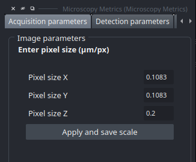
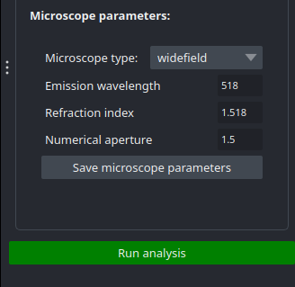

Acquisition Widget
==================

The Acquisition Widget is a form concerning informations about image scaling and microscope acquisition parameters.

Image Scaling Parameters
------------------------

This widget allows user to enter the scaling of the image for each axis. The scaling's unit is µm/px because the value is defined as the metric size (in micrometer) represented by each pixel.

The button "Apply and save scale" confirm entries for the next analysis, and save them for the future. It also change the scaling of the napari viewer to enhance the represented image.

Microscope Acquisition Parameters
---------------------------------

This widget concerns parameters about microscope acquisition:

* **Microscope type**
  The formula of **theoretical resolution** is not the same for all microscopes.
  Implemented types: **widefield**, **confocal**, **multiphoton**, and **spinning disk**.

* **Emission wavelength**
  In **nanometers (nm)**, this is the wavelength of photons captured by the microscope.
  It directly impacts the resolution and image quality.

* **Refraction index**
  Represents how light is refracted when changing from one medium to another.
  Values range from **1.0 (air)** to **1.5 (oil)**.

* **Numerical aperture (NA)**
  Represents the **light-gathering ability** of a microscope objective.
  A high NA allows more rays to enter the objective, producing **highly resolved images**.
  Formula: **NA = Refraction index × sin(θ)**.

