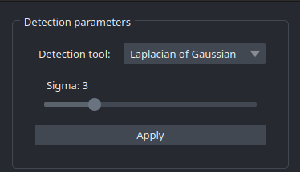
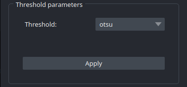
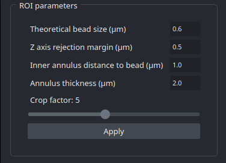

Detection Widget
==================

The Detection Widget is a form concerning informations about beads detection et extraction for analysis.

Detection Parameters
------------------------

This section concerns the choice of tool used for beads detection. Actually, we have four of them : 
* **Peak local maxima** : fastest but also the less accurate of the list.
* **Laplacian of Gaussian** : the most accurate and also the slowest.
* **Difference of Gaussian** : A faster alternative of the LoG, also a little bit less accurate.
* **Centroids** : Faster and more accurate than peak local maxima.

Threshold Parameters
--------------------

This interactive widget allows user to select the most accurate threshold to segment the image. To make it easier, the user can push apply button to see the result of the selected threshold. In the case he selected "manual" threshold, he will have access to a slider and a real-time render.
There are many threshold available, but, the default one is otsu which is really polyvalent. The legacy threshold is used for SBR calculation and is also really accurate. Please, check on the microscopy-metrics documentation for more details.

Region Of Interest Parameters
-----------------------------

A section relative to beads extraction and signal to background calculation. It is one of the most important step of the analysis, it can entirely make it wrong, so user have to take care of the values he enters : 

* **Theoretical bead size (µm)** : Corresponds to the theoretical size of the bead, in other words, it is the size of the beads user wanted them to be when he make the slide.
* **Z axis rejection margin (µm)** : When extracting ROIs, we have to pay attention to exclude beads too near to top/bottom, because they would produce a bad fit and impact the accuracy of analysis.
* **Inner annulus distance to bead (µm)** : To compute signal to background ratio, we use a ring of pixels around the detected bead as "background". This value represents the distance between inner annulus and border of the bead.
* **Annulus thickness (µm)** : The thickness of the ring, or the distance to inner annulus where pixels are "background".
* **Crop factor** : The size of the ROI is estimated by : Theoretical bead size x crop factor. This crop factor is an abritrary value to make ROI bigger or smaller. Usually set to 5.

