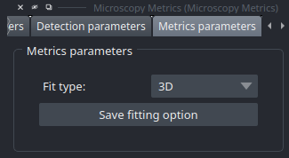

Metrics Widget
==================

The Metrics Widget display calculated metrics and also let user choose 1D, 2D or 3D fitting

Metrics Parameters
------------------------

This section concerns the choice of fit : 

* **1D** : fastest kind of fit, but most of aberration informations are lost.
* **2D** : Based on 1D parameters to make a 2D fit, better representation of the views at centroids, but bad fit at profiles.
* **3D** : Slowest method, but fit all of the ROI despite of a bad fit at profiles.

