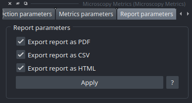

.. _results:

=======
Outputs
=======

At the end of the analysis, the plugin generates **multiple visual and data outputs** to help users **understand, evaluate, and interpret the results**.
These outputs provide comprehensive insights into the **Point Spread Function (PSF)** analysis and facilitate further data processing.

-------------
Napari Viewer
-------------

The **Napari interface** is dynamically updated to display **real-time visualizations** of the analysis results:
    * **Detected Beads and ROIs**: All detected beads and their corresponding **Regions of Interest (ROIs)** are visualized directly in the Napari viewer.
    * **Fitting Display**: Computed fitting results are displayed in the **"Metrics Parameters" widget**, enabling interactive exploration.
    * **3D Visualizations**:
        - **Mesh Representation**: 3D mesh of the bead to visualize its shape and structure.
        - **Skeleton Representation**: Simplified view of the PSF structure for easier analysis.
        - **Curvature Visualization**: Assessment of the skeleton's curvature.

---------
HTML File
---------

For **enhanced interaction**, users can **double-click on a detected ROI** in the Napari viewer to open a **detailed web report** for the selected bead, including:
    * **Bead Position**: Coordinates and visual representation in the image.
    * **Fit Curves**: Graphical representation of the fitting results.
    * **Multi-Axis Views**: Visualization from all axes (X, Y, Z).
    * **Calculated Metrics**: All derived analysis metrics.
    * **Heatmaps**: Visual representation of bead properties.

--------
PDF File
--------

A **comprehensive PDF report** is generated, containing:
    * **Global Analysis Summary**: Overview of the entire analysis.
    * **Individual Bead Reports**: Detailed results for each bead, including all elements from the HTML report (position, fit curves, multi-axis views, metrics, and heatmaps).

--------
CSV File
--------

A **CSV file** is generated, containing **only the numerical metrics** for each bead.
This file is ideal for **further data processing or statistical analysis** in tools like Excel, Python, or R.

.. note::
   The CSV format allows for easy integration with data analysis workflows and custom visualization tools.