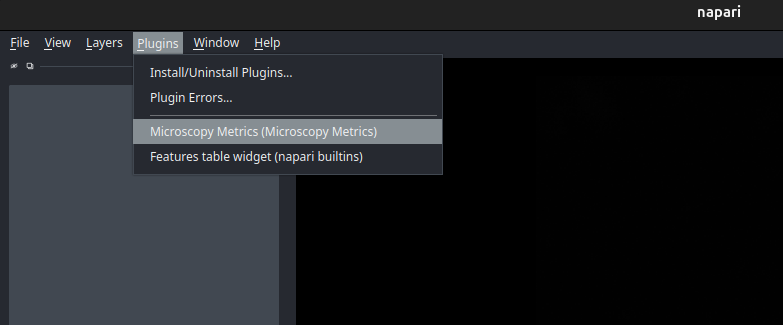

Getting started
===============

.. _installation:

Installation
------------

To use `napari microscopy metrics`, Python 3.12 is required

It is strongly recommended to create a Python virtual environment to avoid conflicts with other packages.
You can choose between **venv** (built-in Python module) or **conda** (Anaconda/Miniconda).

.. tabs::

   .. tab:: Using venv

      .. code-block:: bash

         # Create a virtual environment
         python -m venv myenv

         # Activate the environment
         # On Linux/MacOS:
         source myenv/bin/activate
         # On Windows:
         myenv\Scripts\activate

   .. tab:: Using conda

      .. code-block:: bash

         # Create a conda environment
         conda create -n myenv python=3.12

         # Activate the environment
         conda activate myenv

You can install `napari-microscopy-metrics` via [pip]:

.. code-block:: bash

    pip install napari-microscopy-metrics

If napari is not already installed, you can install `napari-microscopy-metrics` with napari and Qt via:

.. code-block:: bash

    pip install "napari-microscopy-metrics[all]"

To install latest development version :

.. code-block:: bash

    pip install git+https://github.com/MontpellierRessourcesImagerie/napari-microscopy-metrics.git

You will also need to install `microscopy-metrics` and `auto-options` from MRI github :

.. code-block:: bash

    pip install --upgrade git+https://github.com/MontpellierRessourcesImagerie/microscopy-metrics.git

.. code-block:: bash

    pip install --upgrade git+https://github.com/MontpellierRessourcesImagerie/auto-options-python.git

.. _run:

Run
---

Napari microscopy metrics is a napari plugin, so you first have to run a napari application in your python virtual environment : 

.. code-block:: bash

    napari

You now have access to the napari interface. To open the microscopy-metrics plugin, you just have to enable the option at _Plugins > Microscopy Metrics (Microscopy Metrics)

A new widget is supposed to be created at the right side of the application. To use the plugin you can follow this :ref:`tutorial <how_to>` 
